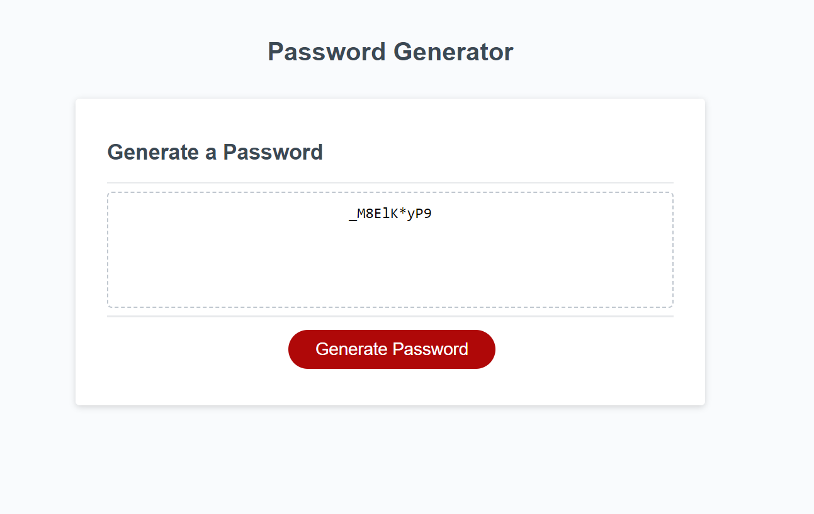

# Password_RNG_Challenge_3

## Screenshot

## Description

For this challenge we were tasked with creating multiple functions in Javascript to both prompt users for their desired length and character types to be used or not.  As well make a new function using the information from the former to generate a random password meeting their criteria.  This assignment tested our ability to use the bascis of Javascript through features such as: setting up variables, calling those variables within functions, prompting users, using 'if' statements to determine if the users preferences are applicable in our password generation, for loops to run the generation to the desired amount, and call functions to have them actually run. 

## Installation

N/A

## Usage

The application of this homework assignment is incredibly relevant.  Walking through the steps to generate, first of all, an interactable feature nested within a website that allows us to interact with the user, as well create a boolean of randomly generated information; this kind of knowlege is both fascinating and extremly useful for web development.  Lastly, the site itself is fantastic for gathering user data, and can actually be used for password generation!

## Credits

(JD Tadlock)  (RUT-VIRT-FSF-FT-05-2023-U-LOLC)

## License

MIT License

Copyright (c) 2023 matthewlazarowitz

Permission is hereby granted, free of charge, to any person obtaining a copy
of this software and associated documentation files (the "Software"), to deal
in the Software without restriction, including without limitation the rights
to use, copy, modify, merge, publish, distribute, sublicense, and/or sell
copies of the Software, and to permit persons to whom the Software is
furnished to do so, subject to the following conditions:

The above copyright notice and this permission notice shall be included in all
copies or substantial portions of the Software.

THE SOFTWARE IS PROVIDED "AS IS", WITHOUT WARRANTY OF ANY KIND, EXPRESS OR
IMPLIED, INCLUDING BUT NOT LIMITED TO THE WARRANTIES OF MERCHANTABILITY,
FITNESS FOR A PARTICULAR PURPOSE AND NONINFRINGEMENT. IN NO EVENT SHALL THE
AUTHORS OR COPYRIGHT HOLDERS BE LIABLE FOR ANY CLAIM, DAMAGES OR OTHER
LIABILITY, WHETHER IN AN ACTION OF CONTRACT, TORT OR OTHERWISE, ARISING FROM,
OUT OF OR IN CONNECTION WITH THE SOFTWARE OR THE USE OR OTHER DEALINGS IN THE
SOFTWARE.

